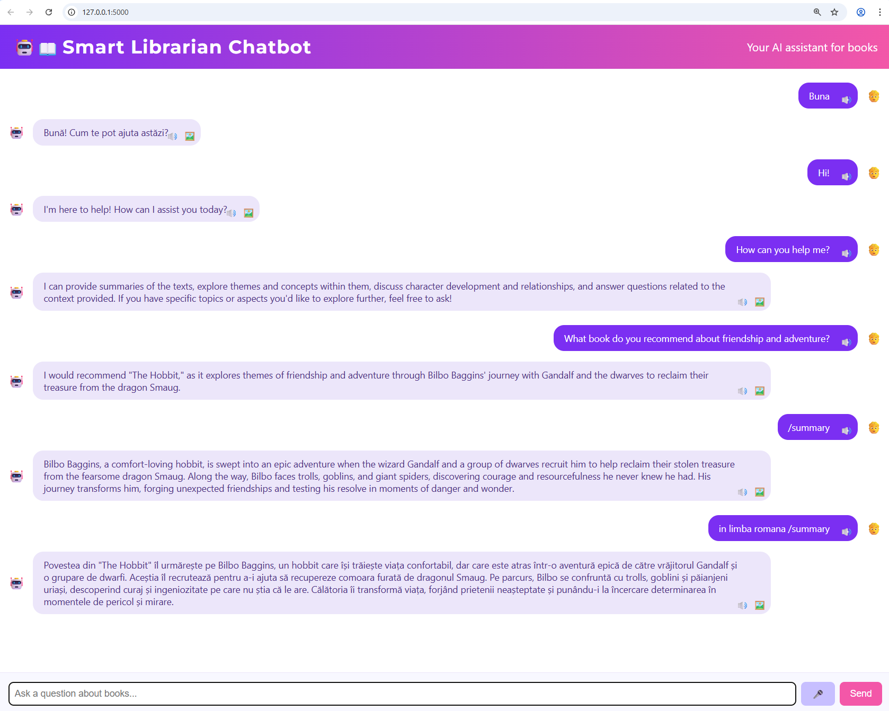
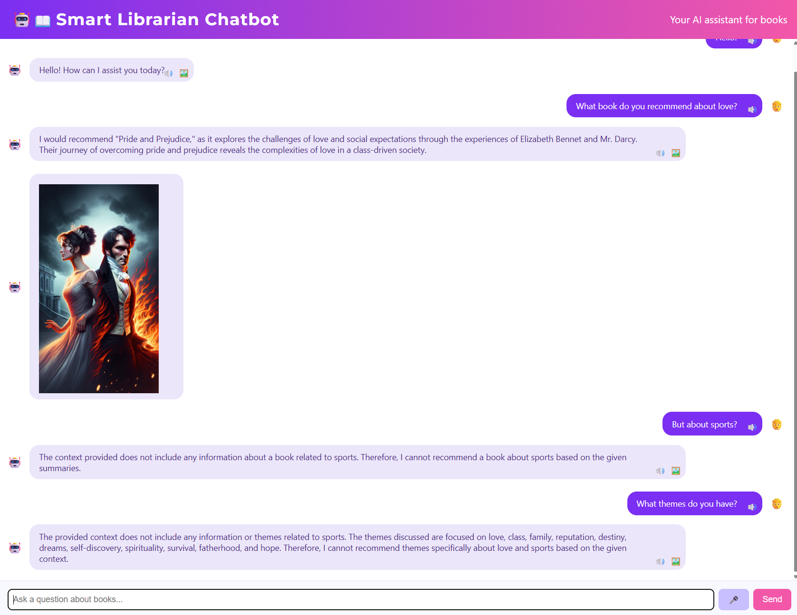
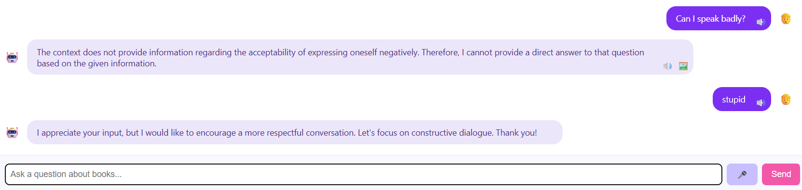

# Smart Librarian Chatbot

## Overview
Smart Librarian is an AI-powered book recommendation and information chatbot. It uses Retrieval-Augmented Generation (RAG) with OpenAI and ChromaDB to answer user questions based on a curated book database. The project features a modern web interface, text-to-speech, image generation, and robust language filtering.

---

## Architecture
- **Backend:** Python (Flask), ChromaDB for vector search, OpenAI API for LLM and TTS.
- **Frontend:** HTML, CSS, JavaScript (no framework), custom chat UI.
- **Data:** Book summaries and themes stored in JSON and indexed in ChromaDB.
- **Deployment:** Docker and Docker Compose for easy setup and portability.

├── backend/
│   ├── app.py                # Flask backend, API, main logic
│   ├── config.py             # Backend configuration
│   ├── static/
│   │   └── style.css         # CSS styles for the interface
│   └── templates/
│       └── index.html        # Main chat interface
│
├── data/
│   └── book_summaries.json   # Book summaries data
│
├── services/
│   └── chunk_and_insert.py   # Script for indexing data in ChromaDB
│
├── screenshots/
│   ├── first.png
│   ├── second.png
│   └── third.png             # Application screenshots
│
├── Dockerfile                # Docker container configuration
├── docker-compose.yml        # Docker services orchestration
├── requirements.txt          # Python dependencies
└── README.md                 # Project documentation
├── Dockerfile                # Configurare container Docker
├── requirements.txt          # Dependențe Python
└── README.md                 # Documentație proiect
```
---
---

## Features
- **Book Q&A:** Answers questions about books using only the data in ChromaDB/JSON.
- **Theme Listing:** Politely lists available book themes if no match is found.
- **Text-to-Speech (TTS):** Uses OpenAI TTS for voice playback of bot responses.
- **Image Generation:** Generates images using OpenAI DALL-E, shown as separate chat bubbles.
- **Language Detection:** Detects and responds in the user's language (Romanian/English).
- **Inappropriate Language Filtering:** Uses OpenAI to detect and respond politely to offensive input.
- **Modern UI:** Chat bubbles, avatars, emojis, loading animation, and responsive design.

---

## Setup & Usage

### 1. Prepare Book Data
- Place your book summaries in `data/book_summaries.json`.
- Run the chunking script to index books in ChromaDB:
  ```bash
  python services/chunk_and_insert.py
  ```

### 2. Environment Configuration
- Create a `.env` file with your OpenAI and ChromaDB credentials:
  ```env
  OPENAI_API_KEY=your_openai_key
  OPENAI_CHAT_MODEL=gpt-4o-mini
  OPENAI_EMBEDDING_MODEL=text-embedding-3-small
  
  CHROMA_API_KEY=your_chromadb_key
  CHROMA_HOST=api.trychroma.com
  CHROMA_TENANT=your_chromadb_tenant
  CHROMA_DATABASE=your_chromadb_db
  ```

### 3. Build & Run
- Build and start the app using Docker Compose:
  ```bash
  docker-compose up --build
  ```
- Access the chatbot at [http://localhost:5000](http://localhost:5000)

---

## File Structure
- `backend/app.py` — Main Flask backend, API endpoints, RAG logic, TTS, image generation.
- `backend/templates/index.html` — Main chat UI, frontend logic, loading animation.
- `backend/static/style.css` — Custom styles for chat bubbles, avatars, and layout.
- `data/book_summaries.json` — Book summaries and themes (used for recommendations).
- `services/chunk_and_insert.py` — Script to chunk and index books in ChromaDB.
- `Dockerfile`, `docker-compose.yml` — Containerization and deployment.
- `.env` — Environment variables (not committed).

---

## Contributors
- Alexandra Simona Danca (project lead)
- GitHub Copilot (AI assistant)

---

## Troubleshooting
- **No book recommendations:** Ensure `book_summaries.json` is populated and ChromaDB is indexed.
- **OpenAI errors:** Check your API key and model names in `.env`.
- **TTS/Image issues:** Verify OpenAI API supports the requested features and your key has access.
- **Docker issues:** Rebuild containers and check port mappings.

---

## Future Improvements
- Add user authentication and profiles.
- Support for more languages and book sources.
- Admin dashboard for book management.
- Advanced analytics and feedback collection.
- Mobile-friendly UI enhancements.

---

## License
This project is for educational and demonstration purposes. See LICENSE for details.

---

## Main Functions: Technical Details & Code Snippets

### Backend (Flask)

#### `index()`
Renders the main chat interface.
```python
@app.route("/")
def index():
    return render_template("index.html")
```

#### `ask()`
Handles user questions, reformulates queries, retrieves context, and generates answers.
```python
@app.route("/ask", methods=["POST"])
def ask():
    data = request.json
    question = data.get("question", "")
    # Language detection, inappropriate language filtering, context retrieval, OpenAI response
    # ...existing code...
    return jsonify({"answer": answer, "context": context})
```
- Uses OpenAI for language detection and polite responses.
- Only recommends books/themes from ChromaDB/JSON.

#### `generate_image()`
Generates images using OpenAI DALL-E.
```python
@app.route("/generate_image", methods=["POST"])
def generate_image():
    data = request.json
    prompt = data.get("prompt", "")
    response = openai_client.images.generate(
        model="dall-e-3",
        prompt=prompt,
        n=1,
        size="512x512"
    )
    url = response.data[0].url
    return jsonify({"url": url})
```

#### `tts()`
Converts text to speech using OpenAI TTS.
```python
@app.route("/tts", methods=["POST"])
def tts():
    data = request.json
    text = data.get("text", "")
    voice = data.get("voice", "alloy")
    response = openai_client.audio.speech.create(
        model="tts-1",
        voice=voice,
        input=text
    )
    audio_bytes = response.content
    return send_file(
        io.BytesIO(audio_bytes),
        mimetype="audio/mpeg",
        as_attachment=False,
        download_name="speech.mp3"
    )
```

### Frontend (JavaScript in `index.html`)

#### `sendQuestion()`
Handles user input, displays loading animation, sends questions to backend, and renders bot responses.
```js
function sendQuestion() {
  // ...existing code...
  const loadingRow = showLoadingBubble();
  fetch('/ask', { ... })
    .then(res => res.json())
    .then(data => {
      if (loadingRow && loadingRow.parentNode) loadingRow.parentNode.removeChild(loadingRow);
      // ...render bot response...
    });
}
```

#### `showLoadingBubble()`
Displays animated loading dots while waiting for the bot's response.
```js
function showLoadingBubble() {
  // ...creates and appends loading animation...
}
```

#### `speakText()`
Sends text to the backend `/tts` endpoint and plays the returned audio.
```js
window.speakText = function(text) {
  fetch('/tts', { ... })
    .then(response => response.blob())
    .then(blob => {
      const audioUrl = URL.createObjectURL(blob);
      const audio = new Audio(audioUrl);
      audio.play();
    });
}
```

### Data & Services

#### `chunk_and_insert.py`
Reads book summaries from JSON, chunks them, and inserts them into ChromaDB for fast semantic search.
```python
with open(JSON_PATH, "r", encoding="utf-8") as f:
    books = json.load(f)
# ...chunking and insertion logic...
```

---

## Screenshots

Below are example screenshots of the Smart Librarian Chatbot in action:

### Main Chat Interface


### Book Recommendation Example


### Summary and Language Features


---

## How Functions Work Together
- The frontend collects user input and sends it to the backend.
- The backend processes the question, retrieves relevant book data, and generates a response using OpenAI.
- If requested, the backend generates images and speech, which are returned to the frontend for display.
- All responses are shown in the chat interface, with loading animations and avatars for clarity.
